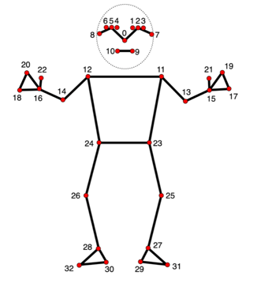
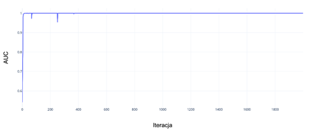
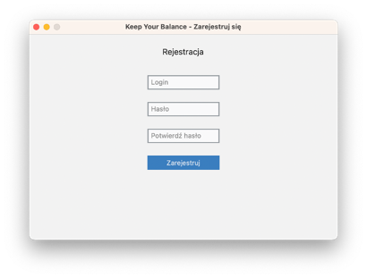
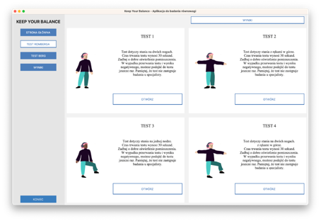
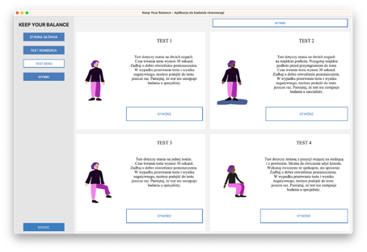

# Engineering-Thesis
This repository contains my engineering thesis focused on the development of an application designed for automated balance tests using vision data captured through a computer camera. The application is specifically tailored for operation on computers.

The project includes the implementation of software to capture data, train, and test a neural network capable of recognizing predefined poses within the application. The classifier is trained to distinguish between 4 poses: standing on two legs with arms down, standing on one leg with arms down, standing on two legs with arms up, and standing on one leg with arms up. These poses form the basis for automated balance tests, including variations of Romberg tests and tests from the Berg balance scale. The test suite covers both static and dynamic balance tests, with dynamic tests involving changes from standing to sitting position, detected based on the angles between the hip, knee, and ankle. The software is implemented in Python.

The application also features user registration and login functionalities, ensuring secure storage of user data in a database. Upon logging in or registering, users gain access to the main window of the application, where they can perform tests and view results. Test outcomes, whether positive or negative, are saved in a separate table within the database.

## Libraries used in the project

**Mediapipe** 

A library for building pipelines for processing multimodal data (such as video, audio, etc.) in machine learning applications. Used specifically for pose detection and landmark identification in this project.

    

Image 1. Graphic representation of the distribution of the 33 points detected by the MediaPipe Pose model on the human body.

**OpenCV**

Library for image and video processing. Used for acquiring visual data from the computer camera and processing it.

**Keras**

An API interface for TensorFlow, making it easier to build and train neural networks. Used to construct the pose classifier model.

**Tkinter**

Standard Python interface to the Tk GUI toolkit. Used for creating the graphical user interface (GUI) of the application.

**Custom Tkinter Components**

Custom components built with Tkinter for the application's specific GUI requirements.

## Training and testing neural network
The Sequential class is one of the main tools of the Keras library. It is an intuitive, high-level tool for building an artificial neural network. I use it to create a network containing multiple layers arranged sequentially. The artificial neural network I created is designed to classify individual data collected with the MediaPipe library into particular poses. It is a recurrent neural network using the Long Short-Term Memory (LSTM) architecture.

Analyzing the parameter waveforms, I noticed that the neural network is learned most quickly and efficiently using the Adamax optimizer. Around 400 iterations, the model reaches maximum parameter values and the model does not overlearn within 2000 iterations. Parameter wobbles occur only at the beginning of learning (<400 iterations), so I am able to learn the model in 600 - 800 iterations, which saves time.

    

Image 2. The course of the dependence of the value of the AUC parameter on the number of iterations of learning the model with the Adamax optimizer (Adaptive moment estimation with Maximum).

## Results
The application allows users to perform automated balance tests using their computer's camera. Upon launching the application, the user is presented with a user-friendly interface created with Tkinter, where they can choose from a variety of balance tests.

    

Image 3. Login window.

    

Image 4. Romberg Tests.

    

Image 5. Berg Tests.

Most of implemented tests check static balance.
One of the tests located in the "BERG TEST" tab concerns sitting down and standing up. This is the only test that checks dynamic balance. This test uses only the MediaPipe library and analyzes the angles between selected characteristic points of the silhouette.